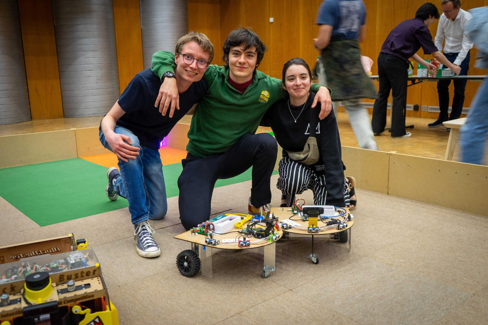

# Robot competition
An EPFL robot competition to collect as many legos as possible in a given time through fully automated robots. For this project we decided to use two automated usign a ROS backbone running on a raspberry pi 4 running ROS2 with the code available in this repo. In order to find the lego we used computer vision. We spent the whole semester working on the project with Johan, Maya and myself(Owhenthesaints).  

We arrived 3rd out of the 6 (one lego was dropped 1 cm from the base causing us to lose 2nd place) 

## Commands to run ros packages
To rebuild files (compile)
colcon build 

To run a node :
ros2 run [packet] [node]

To list all topics :
ros2 topic list

To list what is on a topic :
ros2 topic echo [path of topic]

